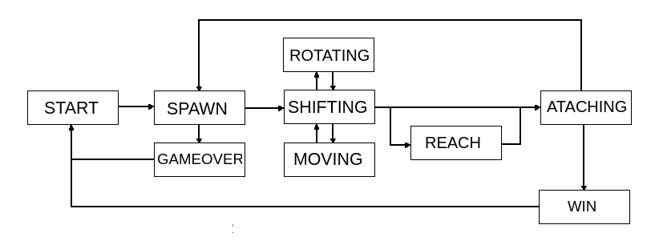
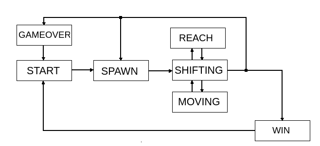

# BrickGame

## Установка

Цели Makefile:

- all 
Устанавливает игры BrickGame и BrickGame_terminal в папку ./src

- install
Устанавливает игры BrickGame и BrickGame_terminal в папку ./src

- uninstall 
Удаляет игры BrickGame и BrickGame_terminal
 
- dvi
Открывает README_RUS.md

- dist
Создает архив tar уже устанвленной программы в папке ./dist
Запускается после install

- test
Запускает тестирование логики игры

- gcov_report
Просмотр отчета покрытия кода тестированием
Запускается после test

- check
Проверка всего кода clang-format

- valgrind
 Запускатся все тесты через valgrind
 Запускается после test
 
- clean
Удаляет все вновь созданные файлы любой цели Makefile кроме цели install

## Игра tetris

Для игры используются слудующие кнопки:

    S - Начало игры,
    P - Пауза,
    Q - Завершение игры,
    Стрелка влево — движение фигуры влево,
    Стрелка вправо — движение фигуры вправо,
    Стрелка вниз — падение фигуры,
    Стрелка вверх — ни используется в данной игре,
    ПРОБЕЛ - Действие (вращение фигуры).
    
    В поле, справа от игрового поля, отображается информация об уровне, скорости, количестве набранных очков, максимальный результат за все игры, информация о следующей фигуре, пауза.
    
    Максимальное количество очков изменяется во время игры, если пользователь во время игры превышает текущий показатель максимального количества набранных очков.
    При каждом запуске игры, информация о максимальном количестве очков сохраняется.

Начисление очков будет происходить следующим образом:

    1 линия — 100 очков;
    2 линии — 300 очков;
    3 линии — 700 очков;
    4 линии — 1500 очков.	
    
    За каждые набранные 600 очков уровень и скорость игры увеличиваются.
    
    При прохождении 10 уровня - ПОБЕДА.
    
## Игра snake

Для игры используются слудующие кнопки:

    S - Начало игры,
    P - Пауза,
    Q - Завершение игры,
    Стрелка влево — поворот направо,
    Стрелка вправо — поворот налево,
    Стрелка вниз — поворот вниз,
    Стрелка вверх — поворот вверх,
    ПРОБЕЛ - Действие (ускорение змейки).
    
    В поле, справа от игрового поля, отображается информация об уровне, скорости, количестве набранных очков, максимальный результат за все игры, пауза.
    
    Максимальное количество очков изменяется во время игры, если пользователь во время игры превышает текущий показатель максимального количества набранных очков.
    При каждом запуске игры, информация о максимальном количестве очков сохраняется.

Начисление очков будет происходить следующим образом:

    1 очко за каждое съеденное яблоко	
    
    За каждые набранные 5 очков уровень и скорость игры увеличиваются.
    
    При наборе 200 очков - ПОБЕДА.
    
## Конечные автоматы

Конечный автомат (КА) в теории алгоритмов — математическая абстракция, модель дискретного устройства, имеющего один вход, один выход и в каждый момент времени находящегося в одном состоянии из множества возможных.

В игре Tetris используется следуюший КА:

- 

В игре Snake используется следуюший КА:

- 

- КА Tetris состоит из следующих состояний:

    START — состояние, в котором игра ждет, пока игрок нажмет кнопку старта к игре.
    PAUSE - пауза в игре
    SPAWN — состояние, в которое переходит игра при создании очередного блока и выбора следующего блока для спавна.
    MOVING — перемещение блоков по горизонтали
    REACH - фигура опускается вниз до конца
    ROTATION - вращение фигуры
    SHIFTING — состояниеr, когда, после истечения таймера, текущий блок перемещается вниз на один уровень.
    ATACHING — состояние, в которое преходит игра после «соприкосновения» текущего блока с уже упавшими или с землей. Если образуются заполненные линии, то она уничтожается и остальные блоки смещаются вниз.
    WIN — игра окончена победой
    GAMEOVER — игра окончена поражением
    
- КА Snake состоит из следующих состояний:

    START — состояние, в котором игра ждет, пока игрок нажмет кнопку старта к игре.
    PAUSE - пауза в игре
    SPAWN — состояние, в которое переходит игра при создании очередного яблока
    MOVING — повороты змейки
    SHIFTING — состояниеr, когда, после истечения таймера, змейка перемещается вперед на один ход
    REACH - змейка ускоряется и движется на один шаг вперед вне зависимости от таймера
    WIN — игра окончена победой
    GAMEOVER — игра окончена поражением
